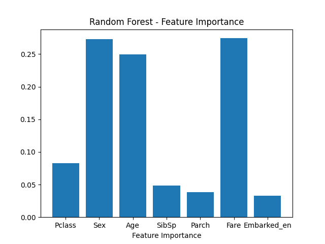

# 🚢 Titanic Survival Prediction

This project predicts whether a passenger survived the Titanic disaster using a machine learning model (Random Forest Classifier). It includes data preprocessing, feature engineering, model training, evaluation, and feature importance visualization — all implemented in a Jupyter Notebook.

---

## 📌 Project Summary

- **Model Used:** Random Forest Classifier  
- **Dataset:** [Titanic Dataset (Kaggle Source)](https://www.kaggle.com/c/titanic/data)  
- **Notebook Name:** `main.ipynb`  
- **Final Accuracy:** 78 %

---

## 🧠 Workflow Overview

### 🔹 1. Data Preprocessing
- Loaded dataset from public GitHub CSV link
- Filled missing `Age` with median
- Filled missing `Embarked` with mode

### 🔹 2. Feature Engineering
- Encoded `Sex` using `OrdinalEncoder`
- Encoded `Embarked` using `LabelEncoder`
- Dropped irrelevant columns:
  - `Name`, `Cabin`, `Ticket`, `Embarked`, `PassengerId`

### 🔹 3. Feature Scaling
- Applied `StandardScaler` for feature normalization

### 🔹 4. Model Building
- Trained a **Random Forest Classifier**
- Used 80-20 train-test split

### 🔹 5. Model Evaluation
- Accuracy Score
- Confusion Matrix
- Classification Report

### 🔹 6. Feature Importance Visualization
- After training, the feature importances were extracted and visualized.
- The plot was saved as an image and is shown below.

  

  *As shown above, features like Sex, Fare, and Pclass were most important in predicting survival.*

---

## 📊 Features Used for Prediction

- Pclass
- Sex
- Age
- SibSp
- Parch
- Fare
- Embarked_en (encoded form of Embarked)

---

## 🚀 How to Run

1. Clone this repository:
   ```bash
   git clone https://github.com/Suryabhan-Patel/titanic-survival-prediction.git

